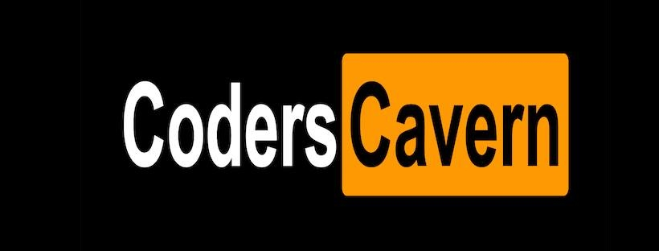

# Coders Cavern

# Features

1. People can post code snippets & text
2. People can share images, memes
3. Main feed page is feeds from everyone who shares public. 
4. Users can add a friend or just follow

# Fun Features

- Posting is called `commit`  
  
# To Do In Sprint

- `[incomplete]` Draw a mockup of what the site will look like 
- `[Done]` Draw a simple flow diagram
- `[incomplete]` List basic API functions 
- `[incomplete]` List out all individual flows (i.e. user log in flow, update flow..)

# Prototype One

- Build out wireframe functionality and UI

## Low Level Features

- Landing page unsigned
- Display mixture of most popular and mid popular and a few non popular commits
- 

## To Do BackLog

- Learn Caching and how to manage logins
- Learn session management 